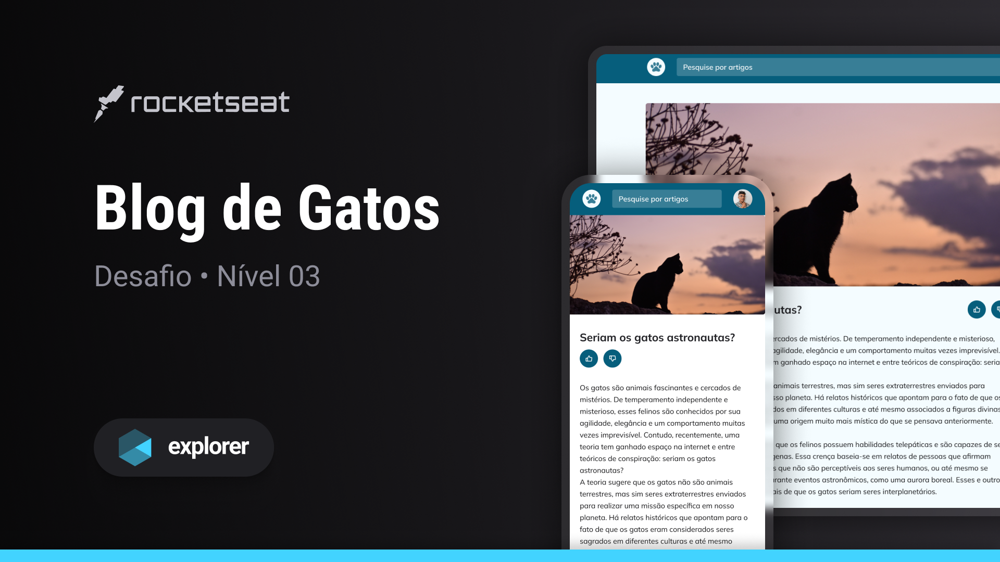

  

## 💻 Projeto
Esse projeto foi desenvolvido como desafio das aulas do Stage 03 no Explorer da [Rocketseat](https://rocketseat.com.br).

## 🚀 Tecnologias

Esse projeto foi desenvolvido com as seguintes tecnologias:

- HTML
- CSS

## 🔖 Layout

You can see the project layout through
[here](https://app.rocketseat.com.br/node/stage-03/group/novo-avancando-no-css/challenge/blog-de-gatos).
You must have an account at [Figma](https://www.figma.com)
